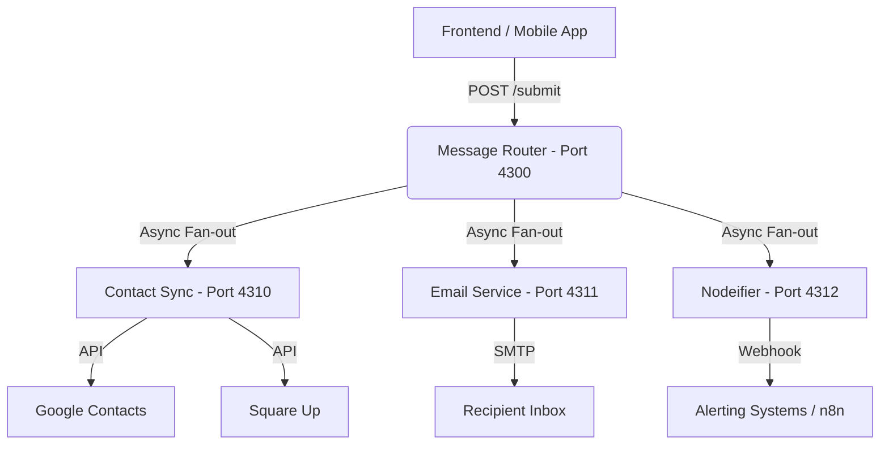

# OYS Live Subprocesses 🚀

A modular microservice stack designed to handle contact synchronization, automated alerts, and specialized routing for the OYS platform.

## 🏗️ Architecture Overview

The system architecture has been modernized into a specialized routing stack to ensure smooth frontend integration and reliable data propagation.



## 📦 Services Summary

| Service | Port | Description |
| :--- | :--- | :--- |
| **Message Router** | `4300` | The primary entry point. Transforms raw JSON and routes it downstream. |
| **Contact Sync** | `4310` | Synchronizes data between Square, Google, and local storage. |
| **Email Service** | `4311` | Pure SMTP service for sending alerts and confirmations. |
| **Nodeifier** | `4312` | Centralized alerting service for pushing notifications to webhooks. |

---

## 🚀 Getting Started

### Prerequisites

- Docker and Docker Compose
- Node.js (for local service development)
- Python 3.11+ (for Contact Sync development)

### Environment Configuration

1. Copy the example environment file:
   ```bash
   cp .env.example .env
   ```
2. Configure the required secrets:
   - `SQUARE_ACCESS_TOKEN`
   - `SMTP_USER` / `SMTP_PASS`
   - `GOOGLE_CREDENTIALS_FILE` (Path to JSON)

---

## 🛠️ Development & Deployment

### Docker Deployment (Recommended)

The stack is designed to run cohesively using Docker Compose.

```bash
# Build and start the entire stack
docker compose up -d
```

### CI/CD Workflow

Deployment is handled via GitHub Actions (`.github/workflows/docker-publish.yml`). 
- **Staging**: Deploys on push to `staging` branch.
- **Production**: Deploys on push to `live` or `main` branches.

All images are built for multi-platform support (`linux/amd64`, `linux/arm64`) to support Raspberry Pi and cloud deployments.

---

## 🔌 API Interaction

### Submitting Data

The **Message Router** is the single point of contact for the frontend.

**Endpoint:** `POST http://<host>:4300/submit`

**Sample Payload:**
```json
{
  "first_name": "John",
  "last_name": "Doe",
  "email": "john@example.com",
  "phone": "0400000000",
  "business_name": "Doe Enterprises",
  "address_line_1": "123 Main St",
  "suburb": "Sydney",
  "state": "NSW",
  "postcode": "2000"
}
```

---

## 📁 Project Structure

```text
oys_live_subprocesses/
├── message-router/   # Entry point & fan-out logic (Node.js)
├── contact-sync/     # Python Sync Engine (Square <-> Google)
├── email-service/    # SMTP Sending Service (Node.js)
├── nodeifier/        # Alerting & Webhook Service (Node.js)
├── docker-compose.yml # Orchestration
└── .github/          # CI/CD Workflows
```

---

## ⚖️ License

This project is specialized for OYS internal infrastructure. See LICENSE for details.
